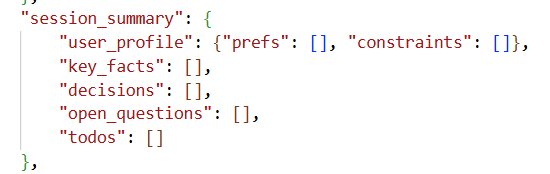
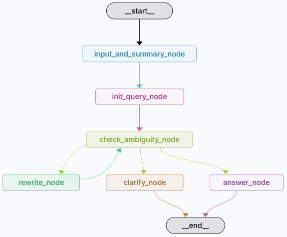
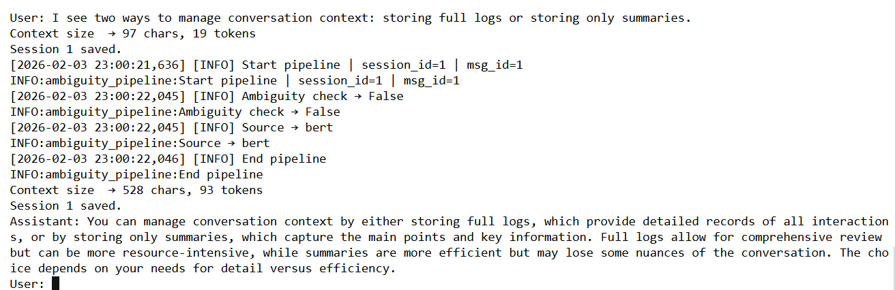
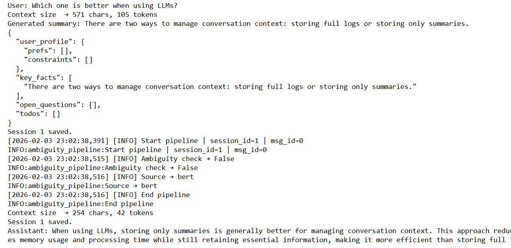
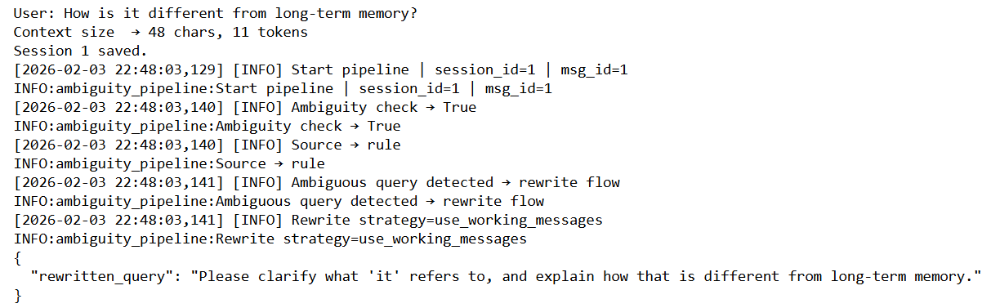
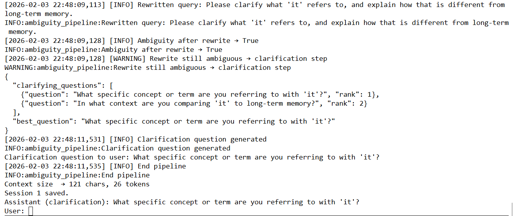
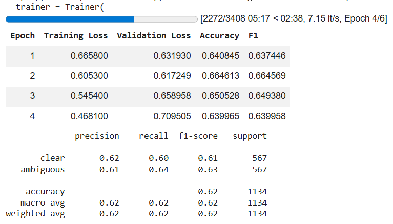

C# Chat Assistant with Session Memory  
**Vulcan Labs Take-Home Test**  
**Author:** Nguyễn Hòa An  

Github: https://github.com/hoaanna/chat-assistant-backend

This project implements a chatbot backend that supports **session memory management** through automatic summarization and **ambiguous query handling** (Query Understanding Pipeline).  
The project includes two versions:  
- **Baseline**: a standard sequential pipeline implementation.  
- **LangGraph**: an advanced version using LangGraph to manage state and complex workflow orchestration.  

---

## Setup Instructions

1. Environment Requirements
   - Python: version 3.11 or higher
   - Transformers: version < 5.0 
   - Required libraries: install via `requirements.txt`  

   ```bash
   pip install -r requirements.txt

2. API Keys Configuration
Create a .env file in the project root and provide the following keys:
- OPENAI_API_KEY: for GPT-4o-mini and GPT-5-nano models
- HUGGINGFACEHUB_API_TOKEN: for loading BART (summarization) and BERT (classification) models
- LANGSMITH_API_KEY: for tracking execution flow, evaluating results, and monitoring agent performance

3. System Configuration
- Edit the config.json file to set memory budgets
Example:
{
  "token_budget": 100,
  "char_budget": 1000,
  "window_size": 5
}

## How to Run the Demo
```bash
!pip install -r requirements.txt
```bash
python baseline_ver.py
```bash
python langgraph_ver.py

### Baseline Pipeline Version
    - Session schema is saved in session_{sessionid}.json.
    - Ambiguous query schema is saved in query_states.json.


### LangGraph Version
Flows to test:
    • Flow 1 — Session Memory Trigger: enter long consecutive messages until exceeding char_budget. The system will log:
    [System] Summarization Triggered!
    • Flow 2 — Ambiguous Query Handling: enter an ambiguous query such as "Is it good?". The system will show the process:
Classification (BERT/Rule) → Rewrite → Clarification (if still ambiguous).

You can also access LangGraph Studio for visualization and debugging:
- langgraph dev --tunnel
- Then open the returned URL, e.g.: https://smith.langchain.com/studio/?baseUrl=https://abcd1234.trycloudflare.com


## High-Level Design Explanation
The system follows the pipeline design required by Vulcan Labs:
1. Session Memory via Summarization
- Conversation messages are tracked.
- When context exceeds thresholds (character or token count), summarization is triggered.
- Summaries are stored in a structured schema:


2. Query Understanding Pipeline
When a new user query arrives:
- Ambiguity Detection
- Rule-based check (keywords, syntax, pronouns).
- BERT classifier (hoaan/bert-ambiguous-query-detector).
- Rewrite / Clarify
- If ambiguous, query is rewritten using context (recent messages + session memory).
- If still ambiguous, clarifying questions are generated.
- Context Augmentation
- Augmented context combines:
- Recent N messages
- Relevant session memory fields
- Answer Generation
- Final prompt is constructed and passed to the LLM for response.

3. LangGraph Orchestration (second version)
- Nodes represent pipeline stages:
input_and_summary_node → init_query_node → check_ambiguity_node → rewrite_node → clarify_node → answer_node
- Edges define transitions based on ambiguity status.
- StateGraph manages session state, query state, and message flow.
- SQLite checkpointing (optional) allows persistence.

Detail Architecture:
• 	AgentState: A shared data structure (TypedDict) that contains the message history, session information (SessionState), and the current query analysis state (QueryState).
• 	Nodes (Processing Units):
• 	input_and_summary_node: Checks the context size and performs summarization using the BART model when thresholds are exceeded.
• 	init_query_node: Re-initializes a clean QueryState for each new message to avoid data contamination from previous chats.
• 	check_ambiguity_node: Uses a combination of the BERT model and spaCy (rule-based) to detect ambiguity.
• 	rewrite_node & clarify_node: Either rewrites the query based on memory or generates clarifying questions if the user’s intent remains unclear.




## Workflow Description
System workflow is designed as follows:
1. 	Receive user query
    • 	Add to  in session schema.
    • 	Check thresholds → if exceeded, trigger summary and save session.
2. 	Check ambiguity
    • 	Case 1: Query is clear
        • 	Build context → LLM generates answer → save to session → check summary.
    • 	Case 2: Query is ambiguous but rewrite is clear
        • 	Rewrite → update query_state → save rewritten query to  (role: user) → check summary → build context → LLM generates answer.
    • 	Case 3: Query remains ambiguous after rewrite
        • 	Rewrite → still ambiguous → generate clarifying questions → select best question → save best question to  (role: user) → check summary → output clarifying question to user.


## Example Test Data
1. Session Memory Trigger
Input (long conversation):


Sau khi thêm một câu truy vấn từ user -> vượt quá ngưỡng 100 token


2. Detect Ambiguiouds and Rewritten


3. Clarification question



## Any Assumptions or Limitations
Assumptions and Limitations:
- LLM dependency: Requires valid OpenAI and HuggingFace API keys.
- Summarization quality: Relies on luisotorres/bart-finetuned-samsum; summaries may vary in quality.
- Ambiguity detection: Rule-based + BERT classifier may produce false positives/negatives.
- Session memory: Short-term only; no long-term persistence beyond saved JSON/SQLite logs.
- Demo scope: CLI-based demo only; no frontend (Streamlit/Gradio optional).
- Structured outputs: JSON schemas are enforced, but may need validation in production.
- Performance: Token counting uses tiktoken; large contexts may slow down summarization.
- Response time: may be slow due to API latency.

# Appandix
## A. Finetune BERT for classifier ambiguious
- Finetune model google-bert/bert-base-uncased
- Dataset: AmbigNQ (14k), balanced across two classes:
    Train: 9088 question
    Validation: 1136 question
    Test: 1134 question
    Total: 11,358

- Result:
    
